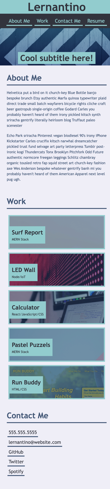

# responsive-portfolio-webpage
A responsive webpage to showcase projects I have worked on.

## Description

The aim of this project is to create a portfolio webpage to display my work. The page will contain links to my projects, contact details and should be responsive to fit different screen sizes.

## Installation

You can install the project on your local machine by cloning or downloading the repository.

## Display

The web page is based on the following mock-ups

 
 The deployed webpage can be accessed [here](https://georgiehackett.github.io/responsive-portfolio-webpage/)